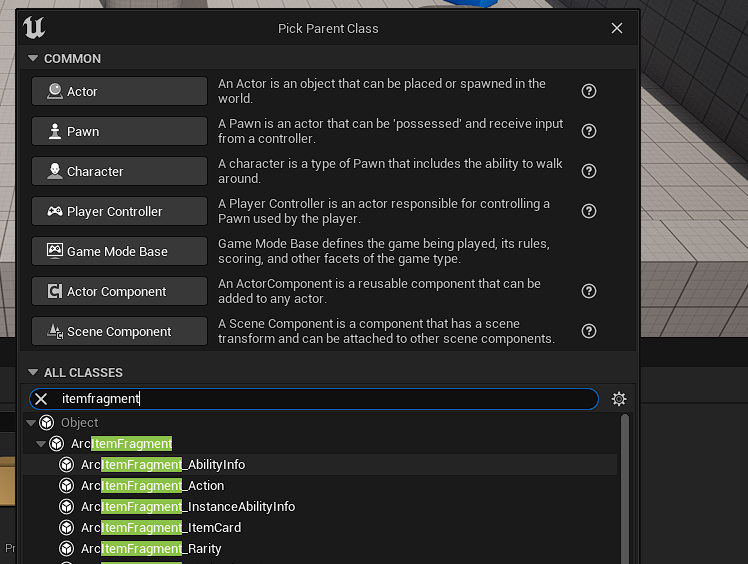
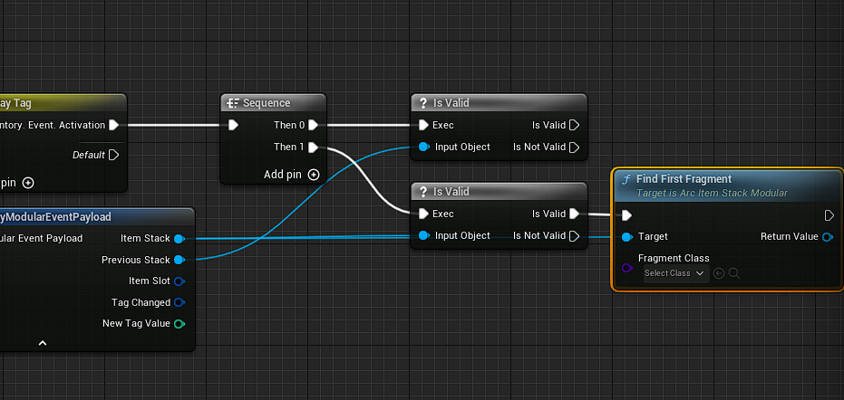

## What Is MoveIt?

!!! quote "MoveIt's Marketplace Description"
    MoveIt! is a semi-procedural locomotion system for Unreal Engine 4 featuring full network replication and easy integration. MoveIt! is aimed at all game types, and works especially well with shooters or melee games that are camera-facing.

    MoveIt! was spawned from a need for high quality, replicated, and performance focused locomotion that simply did not exist. Very clean, easy to use, well documented and works flawlessly in multiplayer while being built on top of a solid foundation allowing for on-going updates and improvements.

    MoveIt! also utilizes multi-threaded animation which is very rare with marketplace assets, and will allow you to have more characters with better performance!

You can acquire it here on the [Unreal Marketplace](https://www.unrealengine.com/marketplace/en-US/product/moveit-locomotion-system)

## Project Setup

To begin integration, ensure that MoveIt is setup according to their documentation

[MoveIt Project Setup](https://github.com/DrowningDragons/MoveIt-Wiki/wiki/Project-Setup)


!!! warning
    Ensure that `"MoveIt"` is part of your PublicDependencyModuleNames in your build.cs!


This document assumes you already have an item definition set up to integrate MoveIt with.  

## Creating an Item Fragment


Once we've set up MoveIt, it's time to integrate arc inventory.

First we're going to create an Item Fragment to hold the MI weapon attachment data.  

=== "Blueprint"
    Right click and create a new Blueprint Subclass.  Expand "All Classes" and create a new class based on `ArcItemFragment`

    

    We'll call this `BP_ItemFragment_MI`.  

    Once created, add a new variable named `WeaponAttachData` of the type FMIWeapon.

=== "C++"
    Create a new C++ class that inherits from `UArcItemFragment` named `UMyItemFragment_MI`, and create a FMIWeapon property named `WeaponAttachData`

    ```cpp
    UCLASS()
    class MYGAME_API UMyItemFragment_MI : public UArcItemFragment
    {
        GENERATED_BODY()
    public:
    
        UPROPERTY(BlueprintReadOnly, EditAnywhere, Category = "Attachment")
        FMIWeapon WeaponAttachData;
    };
    ```

Once the fragment is created, add it to your item your item definition and configure the properties in the struct.

!!! note
    MoveIt ships with a Rifle and Pistol animation pose and offset.  Your own custom animations can be placed here, but that is beyond the scope of this tutorial.

    For more information, refer to the MoveIt [Weapon Documentation](https://github.com/DrowningDragons/MoveIt-Wiki/wiki/Weapons)

## Setting Up the Player

In your Character blueprint, create a new Variable named `WeaponInfo` of type `MI Weapon`.  This will be where we store the Weapon Info struct from the item.

!!! note
    You may have done these next few steps as part of the Simple FPS tutorial or your own integration.  The actual steps may vary here.  

Next, Create a new Skeletal Mesh component as a child of Mesh.  Name it `Held Item Mesh`.

Then, select your Inventory component and go to "Events".  Select OnInventoryEvent and click the big green + button to create an event handler for it.

Drag from the "Even Tag" pin and create a new "Switch On Gameplay Tag" node.  Click the "Add Node" button on the node and in the properties window, add `Inventory.Event.Activation`.  


From here, drag from out from the Payload pin on the event, and Break that struct.  For an Activation event, if the Item Stack is valid, then that item is being made active.  If the Previous Stack is valid, then that item is being made inactive.  

Create a Sequence node from the Activation Tag switch.  In the first element of the sequence, check if Previous Stack is valid, and if so, set your `WeaponInfo` variable to be empty.

In the second element of the sequence, check if the `Item Stack` property is valid, and if so, call `FindFirstFragment` and set the class to search for property to be the classname of the fragment you created above.  



From there, check if the fragment is valid, and if so, set `WeaponInfo` to be the value of the `WeaponAttachData` property on the fragment set above.


Finally, in Functions, hit Override and override the function `Get Weapon Anim Info`.  In there, drag in a getter for your `WeaponInfo` struct and right click on it, select 'Split Struct Pin'. Drag off from `Weapon Info Weapon Pose` an Is Valid check.  If it is not valid, simply return an empty struct.  If it is valid, create a new Return node, and right click on that and Split Struct Pin.  Connect all the pins from your class's weapon struct to the return node's pins, except the `Return Value Weapon Mesh` which should be linked to your `Held Item Mesh` component.


## Conclusion

That is it!  MoveIt will now properly animate your character to hold the weapon.


--8<-- "includes/abbreviations.md"